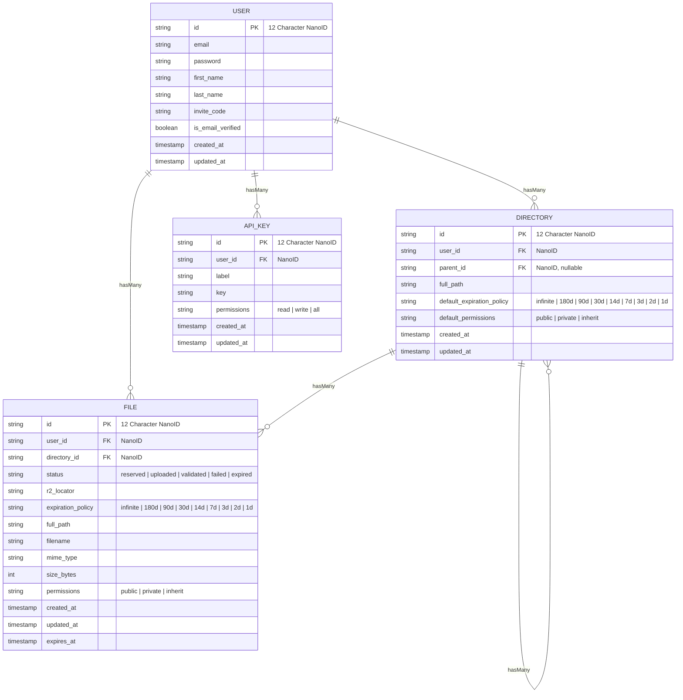

Hulkastorus Technical Design Specification
------------------------------------------

# Overview

This document defines the technical design of **Hulkastorus**, a developer-focused cloud-storage service that turns a drag-and-drop or single `curl` command into an immediately usable public URL.

Traditional platforms (GDrive, S3) slow innovation with hidden IDs, OAuth flows, bucket semantics, and heavyweight SDKs. Hulkastorus removes that friction.

We solve the problem with an opinionated NextJS/Vercel web app, a two-endpoint REST API, and Cloudflare R2 object storage, enforcing privacy/expiry policies only when explicitly requested.

# Terminology

* **R2** – Cloudflare’s S3-compatible object store with zero-egress fees.
* **Pseudo-ID** – 12-character NanoID stable across renames; used in public URLs.
* **Expiry Rule** – policy that hard-deletes objects N days after upload.

# Background

Developers routinely need to shift large artifacts (models, datasets, archives) between machines that have no GUI or OAuth capabilities.
Existing options impose unnecessary ceremony:

* **Google Drive** – Requires OAuth tokens and link unwrapping; headless servers choke on confirmation redirects.
* **Amazon S3** – Expects bucket creation, region selection, ACL tuning, and SDK credentials.
* **Self-hosted MinIO / IPFS** – Adds operational burden.

Internal prototypes show engineers wasting \~30 min per file share, multiplying across CI pipelines and research workflows.
Hulkastorus eliminates 90% of that overhead with a single POST+PUT interaction backed by R2 and minimal metadata in Postgres.

# Goals

* **Shrink time-to-share** a 1 GB file to **<30 s** from dashboard or CLI.
* **Eliminate SDK dependency**: everything possible with `curl` and a prefilled URL.
* **Maintain privacy** defaults: no unauthenticated browse of non-public files.
* **Hold p95 download latency** < 250 ms for files < 50 MB (USA).
* **Cap operational cost** to ≤ \$0.004 / GB-month inclusive of egress.

# Non-Goals

* Provide fine-grained IAM or role hierarchies.
* Offer versioning or soft-delete retention.
* Compete with full-featured object stores for petabyte-scale archives.

# Proposed Solution

Hulkastorus consists of **four** cooperating components whose code is hosted in a new `hulkastorus` GitHub repository.

- **Web Server** - a Vercel-hosted NextJS app (App Router) providing both a web frontend and a REST API.
- **Cron Jobs** - Vercel-hosted cron jobs for deleting expired files and refreshing user quotas.
- **Storage Layer** - an R2 Storage Bucket for storing the files themselves.
- **Database** - a Neon Postgres Database for all other persistent data.

## Web Server

A Vercel-hosted NextJS app that serves both the web frontend, REST API, and cron job endpoints.

### Pages

The following pages are implemented with React server components and server actions.

- `/`
- `/docs`
- `/login`
- `/register`
- `/reset-password`
- `/app/dashboard`
- `/app/browse/:path`
- `/app/settings`

Each REST API route's underlying logic is referenced by pages as a server action.
See [Page Details](#Page-Details) for more information.

### REST API Routes

The following REST API routes are implemented:

- POST /api/v1/users (create a new user)
- GET /api/v1/users/:id (get user metadata)
- GET /api/v1/users/:id/usage (get user quota and usage stats)
- PUT /api/v1/users/:id (update a user basic profile info)
- POST /api/v1/users/:id/email-verification (sends a verification email)
- PUT /api/v1/users/:id/email-verification (verify a user's email address)
- PUT /api/v1/users/:id/password (update a user's password)
- DELETE /api/v1/users/:id (delete a user)
- GET /api/v1/api-keys (list API keys)
- POST /api/v1/api-keys (create a new API key)
- DELETE /api/v1/api-keys/:key_id (delete an API key)
- GET /api/v1/directories (list directories)
- GET /api/v1/directories/:id (get directory metadata)
- POST /api/v1/directories (create a new directory)
- DELETE /api/v1/directories/:id (delete a directory)
- PUT /api/v1/directories/:id (rename, move, set permissions or expiry a directory)
- GET /api/v1/files (list files)
- GET /api/v1/files/search (search for files)
- POST /api/v1/files (start uploading a new file)
- DELETE /api/v1/files/:id (delete a file)
- PUT /api/v1/files/:id (rename, move, set permissions or expiry for a file)
- PUT /api/v1/files/:id/status (trigger file metadata update post-upload)
- GET /api/v1/files/:id (get file metadata)
- GET /api/v1/files/:id/download (get a download URL for a file)


See [REST API Route Details](#REST-API-Route-Details) for more information.

### Pageless Routes

The following routes do not have a page component, nor are intended for REST-like usage.

#### GET `/logout`

Destroys the session token.

#### GET `/verify-email?token=TOKEN`

Verifies a user's email address with a valid, unexpired JWT.
Identical behavior to PUT `/api/v1/users/:id/email-verification` but with a GET method and a public-facing URL.

#### GET `/d/:pseudo_id[?token=TOKEN]`

Identical behavior to GET `/api/v1/files/:id/download`, just friendlier, public-facing URL.

### UI Components

Shared UI Components follow the Shadcn UI component library pattern.
Common components, unless otherwise specified, are sourced from Shadcn's default radix-ui implementation.

### Key Decisions

- **Runtime**: NextJS 15 App Router
- **Auth**: NextAuth with JWT
- **UI<->DB Communication**: server actions, duplicated functionality in REST API routes for CLI
- **Rate-Limiting**: Vercel Edge Config

## Cron Jobs

* **OrphanSweep** – every 6h delete R2 objects with no matching row + mark rows with missing R2 objects.
* **ExpirySweep** – every 6h mark expired file rows for deletion.

## Storage Layer

All files are stored in the `hulkastorus-ugc` bucket on Cloudflare R2.

### Key Decisions
* **Bucket layout**: `<env>/<lifecycle_policy>/<user_id>/<file_id>`
* **Lifecycle rules**: bucket-level rules delete files in the lifecycle policy prefix after a set period.
* **Object ACL**: always private; public access only via signed URL.

## Database

All user-related data is stored in a `hulkastorus` Postgres database on Neon.
Connections and migrations are made via Prisma in the NextJS app.

### Key Decisions

* **Flavor**: Neon Postgres
* **Schema**: row-level ownership data prevents cross-tenant leakage.
* **Branching**: Neon’s branching enables preview environments per PR.
* **Migrations**: Prisma migrations are executed on service startup.

# Appendix

## Database Schema



## Page Details

### Homepage (`/`)

The marketing page with mostly static content.

#### Design

+----------------------------------------------------------------------------------+
| Hulkastorus logo (hex-dino)              | Docs | Pricing | Login | [ Get Beta ] |
+----------------------------------------------------------------------------------+

|  ┌───────────────────────────── HERO ───────────────────────────────┐            |
|  |  BIG HEADLINE: “Dev-Friendly Cloud                               |            |
|  |                Storage, Hulk-Strong.”                            |            |
|  |  Sub-text: “Instant public URLs & frictionless CLI / Python      |            |
|  |  uploads — minus the SDK bloat.”                                 |            |
|  |                                                                  |            |
|  |  [ Request an Invite ]   [ Read the Docs ]                       |            |
|  └───────────────────────────────────────────────────────────────────┘            |
|                             [ Hulk-dino illustration ]                           |

|  ┌──────────── THREE FEATURE CARDS ────────────┐                                 |
|  | ⚡ One-Command Share  | ↻ Keyless Auth Flow | 📦 ML-Asset Ready               |
|  | Ship files at Raptor | Works with GitHub   | Multipart, resumable uploads;   |
|  | speed; `hulk put,★`  | SSO / cloud IAM;    | content-addressed caching;      |
|  | → link auto-copied & | zero keys in CI     | MD5 + SHA-256 integrity         |
|  | posted to Slack      |                     |                                 |
|  └─────────────────────────────────────────────┘                                 |

|  ┌──────── CODE SNIPPET ────────┐   ┌────────── TESTIMONIAL ──────────┐          |
|  | Tabs: [ Bash ] [ Python ]    |   | “We swapped S3 presign dance    |          |
|  | $ hulk put model.ckpt        |   | for Hulkastorus in an afternoon.|          |
|  | https://hulk.st/or.us/abc123 |   | Links just work.”               |          |
|  | — copied to clipboard ✅      |   |        — ML Infra Lead, VFX Co. |          |
|  └──────────────────────────────┘   |  [ Request Early Access ]       |          |
|                                     └─────────────────────────────────┘          |

|  ┌─────────────── LOGO CAROUSEL ───────────────┐                                 |
|  |  Hooli ◈ Pied Piper ◈ Enron ◈ Theranos ◈   … |  (monochrome, auto-scrolls)   |
|  └──────────────────────────────────────────────┘                                 |

|  ┌─────────────── PRICING COMPARISON ───────────────┐                            |
|  | Plan          | Free            | Pro             | Tres Commas              |
|  |---------------|-----------------|-----------------|--------------------------|
|  | Monthly cost  | **$0** (beta)   | **$0** (beta)   | **$0** (beta)            |
|  | Storage cap   | 10 GB           | 1 TB            | Unlimited                |
|  | Bandwidth     | 50 GB/mo        | 1 TB/mo         | Unlimited                |
|  | Support       | Community       | 24 h SLA        | Dedicated TAM            |
|  | CTA           | [ Get Free ]    | [ Join Waitlist ] | [ Contact Sales ]      |
|  └───────────────────────────────────────────────────┘                            |

|  Footer: © 2025 Hulkastorus • Privacy • Terms • Twitter                           |
+----------------------------------------------------------------------------------+


#### Common Components Needed

| Component         | Source |
| ----------------- | ------ |
| Top Navbar        | Custom |
| Tabbed Code Block | Custom |
| Tabs              | Shadcn |
| Button            | Shadcn |

#### Server Actions Needed

None.

### Docs (`/docs`)

#### Design

See [Homepage](#Homepage-homepage)

#### Common Components Needed

| Component         | Source |
| ----------------- | ------ |
| Top Navbar        | Custom |
| Tabbed Code Block | Custom |
| Tabs              | Shadcn |
| Button            | Shadcn |

#### Server Actions Needed

None.

### Login (`/login`)

#### Design

+----------------------------------------------------------------------------------+
| Hulkastorus logo (hex-dino, top-left)                  |  [ ← Back to Home ]     |
+----------------------------------------------------------------------------------+
|                                                                              |
|  ┌──────────────────────────── LOGIN PANEL ──────────────────────────────┐  |
|  |                                                                      |  |
|  |   HEADLINE: “Welcome back, beast.”                                   |  |
|  |   Subtext: “Log in to crush some bytes.”                             |  |
|  |                                                                      |  |
|  |   ┌────────────────────────────┐      ┌────────────────────────────┐ |  |
|  |   | Email                     ⌄|      | Password                  ⌄| |  |
|  |   └────────────────────────────┘      └────────────────────────────┘ |  |
|  |                                                                      |  |
|  |   [🦖 Log In]        [ Forgot your password? ]                        |  |
|  |                                                                      |  |
|  |   Don’t have an account? [ Sign up → ]                               |  |
|  └──────────────────────────────────────────────────────────────────────┘  |
|  ┌────────── FOOTER STRIP ──────────┐                                      |
|  | © 2025 Hulkastorus | ToS | GDPR  |                                      |
|  └──────────────────────────────────┘                                      |
+------------------------------------------------------------------------------+


#### Common Components Needed

| Component         | Source |
| ----------------- | ------ |
| Top Navbar        | Custom |
| Card              | Shadcn |
| Input             | Shadcn |
| Button            | Shadcn |
| Toast             | Shadcn (Sonner) |

#### Server Actions Needed

- NextAuth `signIn`
- **`requestPasswordResetEmail`**
    - Sends a password reset email to the user.

### Register (`/register`)

#### Design

+----------------------------------------------------------------------------------+
| hex-dino logo                              |  [ ← Back Home ]                    |
+----------------------------------------------------------------------------------+
|                                                                                  |
| ┌───────────────────────── SIGN-UP PANEL ──────────────────────────┐              |
| | HEADLINE: “Join the private beta.”                              |              |
| | First Name  [________________________]                          |              |
| | Last Name   [________________________]                          |              |
| | Email       [________________________]                          |              |
| | Password    [________________________]                          |              |
| | Confirm Password    [________________________]                  |              |
| | Invite Code [________________________]                          |              |
| |                                                                [🦖 Create Account]|
| | Already registered?  Log in →                                   |              |
| └──────────────────────────────────────────────────────────────────┘              |
+----------------------------------------------------------------------------------+


#### Common Components Needed

| Component         | Source |
| ----------------- | ------ |
| Top Navbar        | Custom |
| Card              | Shadcn |
| Input             | Shadcn |
| Button            | Shadcn |

#### Server Actions Needed

- POST /api/v1/users

### Reset Password (`/reset-password`)

#### Design

See [Login](#Login-login)

#### Common Components Needed

| Component         | Source |
| ----------------- | ------ |
| Top Navbar        | Custom |
| Card              | Shadcn |
| Input             | Shadcn |
| Button            | Shadcn |

#### Server Actions Needed

- **`resetPassword`**
    - Validates the reset token.
    - Updates the password in Postgres.
    - Redirects to login with a success message.

### Dashboard (`/app/dashboard`)

The authenticated home screen where users upload, browse, and manage their stored files and directories.

#### Design

+---------------------------------------------------------------+
|  DRAG-AND-DROP ZONE  (“Drop files or click to browse…”)       |
+-----------------------------+---------------------------------+
| Recent Uploads              | Usage Stats                     |
| ┌──────────────┐            | Total Used: ▇▇▇▇▇ 56 GB / 100 GB|
| | model.ckpt  | … |        | Top Types: .ckpt, .zip, .jpg     |
| └──────────────┘            | Expiring Soon: 4 files          |
+-----------------------------+---------------------------------+


#### Common Components Needed

| Component                        | Source              |
| -------------------------------- | ------------------- |
| App Shell (Top Navbar + Sidebar) | Custom              |
| Checkbox                         | Shadcn              |
| Button / IconButton              | Shadcn              |
| Progress Bar                     | Shadcn              |
| Modal / Dialog                   | Shadcn              |
| Toast (Sonner)                   | Shadcn              |
| Drop-zone (drag-and-drop)        | react-dropzone      |
| Context Menu                     | Shadcn              |

#### Server Actions Needed

- GET /api/v1/users/:id/usage
- POST /api/v1/files
- PUT /api/v1/files/:id/status

### File Manager (`/app/browse/:path`)

A deep-linkable file manager that pre-loads the directory given in `:path`.
This page contains most of the UI for interacting with files.
URL changes push/pop state so the browser’s back button walks the folder tree.

#### Design

+ Breadcrumbs:  /  >  datasets/  >  2025/
+----------------------------------------------------------------------------------+
| 🔍 [ filter… ]                                    |  [ New Folder ]  [ Upload ]  |
|----------------------------------------------------------------------------------|
| Name                | Size   | Modified          | Perm | Expires | … [⚙]       |
| 📄 model.ckpt        | 2.1 GB | 2025-06-04 14:12  | 🌐   | —       | […]        |
| 📄 notes.txt         | 4 KB   | “                 | 👤   | 2025-07-01 | …        |
| 📁 images/           | —      | 2025-06-01        | 👤   | —       | …          |
|----------------------------------------------------------------------------------|
+----------------------------------------------------------------------------------+


#### Common Components Needed

| Component           | Source |
| ------------------- | ------ |
| (Same as Dashboard) | —      |
| Table               | Shadcn |


#### Server Actions Needed

Re-use the Dashboard server actions plus the following:

- POST /api/v1/directories
- GET /api/v1/files
- GET /api/v1/files/search
- PUT /api/v1/directories/:id
- PUT /api/v1/files/:id
- DELETE /api/v1/directories/:id
- DELETE /api/v1/files/:id

### Settings (`/app/settings`)

A four-section management area for user profile, API keys, personal preferences, and account deletion.

#### Design

+----------------------------------------------------------------------------------+
| ── Profile ────────────────────────────────────────────────────────────────────── |
|  Name:        [ Patrick Hulce        ]                                           |
|  Email:       [ patrick@example.com  ]   (✓ verified)                            |
|                                                                                  |


| ── Reset Password ─────────────────────────────────────────────────────────────── |
|  Current Password:    [ ****** ]   (hidden if forget token is set)                |
|  New Password:    [ ****** ]                                                      |
|  Confirm New Password:    [ ****** ]                                              |
|  [ Reset Password ]                                                               |
|                                                                                   |

| ── API Keys ────────────────────────────────────────────────────────────────────── |
|  Existing Keys                     |  Create New Key                             |
|  ┌───────────────────────────────┐ |  Label:  [___________]                      |
|  | Label          Last Used      | |  Perms: ☐ read   ☐ write                   |
|  | default-cli     2 h ago       | |  [➕ Generate & Copy]                       |
|  | datasets-svc    never         | |                                            |
|  └───────────────────────────────┘ |                                            |
|                                                                                  |

| ── Danger Zone ─────────────────────────────────────────────────────────────────── |
|                       [ 🔥 Delete Account ]                                       |
|                                                                                  |
+----------------------------------------------------------------------------------+


#### Common Components Needed

| Component         | Source |
| ----------------- | ------ |
| Form              | Shadcn |
| Input             | Shadcn |
| Switch / Checkbox | Shadcn |
| Button            | Shadcn |
| Table             | Shadcn |
| IconButton        | Shadcn |
| Modal / Dialog    | Shadcn |
| Toast (Sonner)    | Shadcn |

#### Server Actions Needed

- GET /api/v1/users/:id/usage
- GET /api/v1/api-keys
- POST /api/v1/api-keys
- DELETE /api/v1/api-keys/:id
- PUT /api/v1/users/:id
- PUT /api/v1/users/:id/password
- DELETE /api/v1/users/:id

## REST API Route Details

Most of the REST API routes are simple CRUD operations on the database.
The few exceptions are documented below.

### List Endpoints

All list endpoints support the following query parameters:

- `limit`: number of results to return, default 10
- `offset`: number of results to skip, default 0
- `order_by`: field (and optional direction) to sort by, default `order_by=created_at+desc`
- `filter~PROPERTY`: filter results by a property, e.g. `filter~permissions=public`

### POST /api/v1/users

Creates a new user, along with a default directory, API key, and triggers verification email flow.
Requires submission of an invite code "WELCOMETOTHEPARTYPAL".

### GET /api/v1/users/:id/usage

Returns the user's usage data that powers the dashboard.

```typescript
interface CountByType {
    total: number;
    images: number;
    videos: number;
    audios: number;
    models: number;
    datasets: number;
    documents: number;
    other: number;
}

interface Usage {
    file_counts: CountByType;
    byte_counts: CountByType;
    quota_bytes: number;
}
```

### POST /api/v1/files

Creates a new file record as a placeholder for the uploaded file.
Rejects if the user is not email verified.
Rejects if the user has exceeded their quota.
File record status is `reserved` until the client uploads the file.
Directories are autocreated on-the-fly when a file is uploaded into a non-existent path.
Does not accept file content directly; just returns a presigned URL for the client to upload to.

### PUT /api/v1/files/:id/status

Called with `{"status": "uploaded"}` after the client uploads the file.
Triggers validation of the file's content in R2 and transitions the file to `validated` or `failed`.

### POST /api/v1/users/:id/email-verification

Uses mailgun to send a verification email to the user.
Does nothing if the user is already verified.
The verification token is a JWT with the user's ID as the subject, 1 hour expiration, and email address as the claim.

### PUT /api/v1/users/:id/email-verification

Verifies a user's email address in the database.
Requires a valid, unexpired email verification token.

### GET /api/v1/files/:id/download

Redirects to a presigned URL for downloading the file.
ID is parsed into a file ID (NanoID) or a user ID + path, used to look up the file metadata.
Performs the following authorization checks:

- If a NextAuth JWT is present, use that user for authorization.
- If an API key is present, use that user for authorization.
- If a token is present, use that user for authorization.
- If no authorization is present, return 404.

